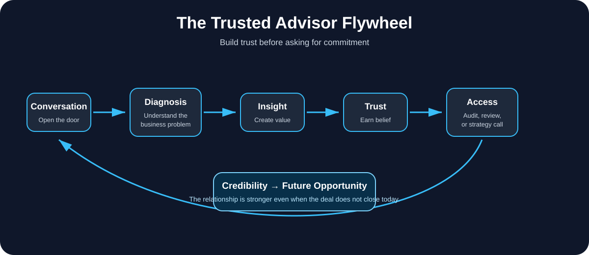

# Trusted Advisor Sales Framework

> A consultative sales framework for turning cold conversations, objections, and "not now" replies into long-term trust, access, and future opportunities.



## What This Is

Most sales playbooks teach people how to push harder.

This framework teaches the opposite: how to become the person a buyer comes back to when timing, priorities, or internal circumstances change.

The Trusted Advisor Sales Framework is designed for consultants, operators, agencies, freelancers, marketplace managers, and growth partners who sell high-trust services where the buyer needs to believe in your judgment before they believe in your offer.

It is especially useful when you are selling services such as:

- E-commerce growth consulting
- Amazon, Walmart, and retail media management
- Marketplace operations
- Performance marketing
- Agency partnerships
- Fractional leadership
- B2B consulting
- White-label execution
- Audit-led selling

---

## Core Idea

The goal is not to close every conversation immediately.

The goal is to leave every conversation with more trust than you had before.

A buyer may say:

- "Not right now."
- "We already have someone."
- "Let me think about it."
- "Budget is not the issue, but I need to understand the plan."
- "Things can change quickly."

Most sellers panic.

Trusted advisors slow down, diagnose the real objection, create value, and stay positioned for the moment when the buyer is ready.

---

## The Trusted Advisor Flywheel

```text
Conversation
   ↓
Business Diagnosis
   ↓
Useful Insight
   ↓
Trust
   ↓
Access
   ↓
Audit / Strategic Review
   ↓
Credibility
   ↓
Future Opportunity
   ↓
Expanded Relationship
```

Do not skip steps.

If you try to close before trust exists, you create resistance.

If you create trust before asking for the close, the close becomes a natural next step.

---

## Principles

### 1. Diagnose Before You Pitch

Never begin with the service.

Begin with the business problem.

Ask:

- What is not working?
- Why does this matter now?
- What has already been tried?
- What would make this worth changing?
- What would a successful outcome look like financially?

A weak seller asks, "Do you want to hire me?"

A strong advisor asks, "What is preventing the business from reaching the next level?"

### 2. Sell Thinking Before Selling Labor

Anyone can offer hours.

Very few people can offer judgment.

Instead of leading with:

> I can manage your ads for you.

Lead with:

> I can help identify where growth is being limited, where spend may be leaking, and what I would prioritize if I were responsible for the outcome.

The buyer should feel that hiring you means gaining better decision-making, not just another pair of hands.

### 3. Respect the Current Setup

Never attack the current agency, manager, employee, or vendor.

Instead of:

> Your ads manager is doing this wrong.

Say:

> There may be an opportunity to improve the way capital is being allocated across campaigns and search intent.

Business owners dislike people who create drama.

They trust people who improve systems.

### 4. Translate Tactics Into Business Outcomes

Do not stop at tactical language.

Instead of only discussing CPC, CTR, ROAS, ACOS, bid changes, or campaign structure, translate those into profitability, capital allocation, contribution margin pressure, market share, customer acquisition quality, revenue quality, and scalability.

Executives do not buy tactics.

They buy better outcomes.

### 5. Handle "No" Without Burning the Future

A "no" is not always a rejection.

It may mean wrong timing, an existing vendor, internal transition, strategic uncertainty, low urgency, or not enough trust yet.

Only one of those is solved by pitching harder.

The rest are solved by staying useful.

---

## Objection Map

| Buyer Says | What It Usually Means | Best Response |
|---|---|---|
| "Let me think about it." | They need time, internal alignment, or a clearer business case. | Give space. Follow up with value, not pressure. |
| "We already have someone." | They do not want disruption unless the pain is high. | Respect the setup and offer a second perspective. |
| "Budget is not the issue." | They are evaluating strategy and trust, not price. | Stop selling cost. Show the plan. |
| "We are not making changes now." | Timing or priorities are blocking the deal. | Keep the relationship warm. Do not force urgency. |
| "Things might change quickly." | You are being kept as an option. | Stay visible with useful insights. |

---

## The Audit-Led Selling Method

The fastest way to build trust is to produce a diagnosis the buyer has not seen before.

A strong audit answers five questions:

1. Where is money being lost?
2. Where is growth being limited?
3. What is being under-leveraged?
4. What should be fixed first?
5. Why does this matter financially?

A weak audit says:

> Campaign A has low ROAS.

A strong audit says:

> The account appears to be generating revenue but allocating too much capital into low-efficiency discovery traffic while proven search intent remains under-structured. The opportunity is to recover profitability before increasing spend.

The second version sounds like business strategy.

---

## The Four-Level Audit Framework

### Level 1: Surface Metrics

Spend, sales, ROAS, orders, CPC, and conversion rate.

Useful, but not enough.

### Level 2: Pattern Recognition

Which campaigns consume disproportionate spend? Which terms bleed spend repeatedly? Which products generate efficient sales? Which traffic types convert best?

### Level 3: Business Diagnosis

Is the account optimized for revenue or profit? Is the business buying traffic or acquiring customers? Is spend going to the products that deserve it? Are managers scaling winners or hiding them inside catch-all structures?

### Level 4: Executive Decision Plan

What should change in the next 72 hours? What should be rebuilt in 30 days? What should be scaled in 90 days? What is the risk of doing nothing?

---

## Follow-Up Philosophy

Never follow up just to ask whether someone read your last email.

Bad:

> Just checking in.

Better:

> I was thinking about our conversation and one thing I would look at first is whether growth is being limited by structure, not demand.

Better follow-ups add value, context, or useful perspective.

They do not ask the buyer to manage your anxiety.

---

## When the Buyer Says "Not Now"

The correct response is not to discount.

It is not to push harder.

It is to preserve trust.

Example:

> That makes complete sense. I appreciate the transparency. If your strategy changes or you ever want another perspective, I would be happy to help. Wishing you and the team success with the next phase.

This keeps you positioned as a professional, not a desperate vendor.

---

## The Trusted Advisor Standard

Every message should pass this test:

- Does this make me look more credible?
- Does this reduce pressure or increase it?
- Does this help the buyer make a better decision?
- Does this strengthen the relationship even if they do not buy today?
- Would I be comfortable if the buyer forwarded this internally?

If the answer is no, rewrite it.

---

## Repository Structure

```text
trusted-advisor-sales-framework/
├── README.md
├── LICENSE
├── CONTRIBUTING.md
├── assets/
│   └── trusted-advisor-flywheel.svg
├── docs/
│   ├── philosophy.md
│   ├── discovery-calls.md
│   ├── objection-handling.md
│   ├── follow-up-playbook.md
│   ├── audit-framework.md
│   ├── email-templates.md
│   ├── negotiation.md
│   └── common-mistakes.md
├── case-studies/
│   └── marketplace-growth-advisor.md
└── examples/
    ├── cold-email.md
    ├── warm-reengagement.md
    ├── no-to-not-now.md
    └── audit-delivery-email.md
```

---

## Who This Is For

This framework is for people who do not want to win business through pressure.

It is for operators, consultants, and growth partners who want to win because their thinking is trusted.

The objective is simple:

> Become the obvious choice when the timing is right.

---

## Author

Built by **Owais Zahoor** — e-commerce growth operator focused on Amazon, Walmart, Vendor Central, marketplace strategy, retail media, and consultative growth partnerships.
